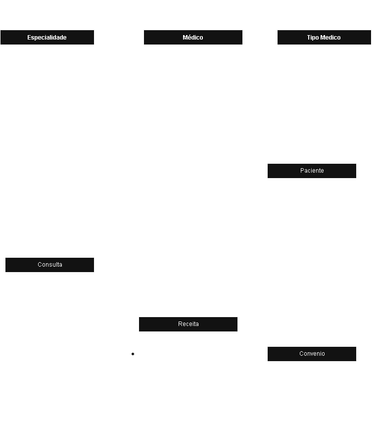

# 🏥 Sistema de Controle de Consultas Médicas

Este projeto tem como objetivo desenvolver um sistema de banco de dados para a área clínica de um hospital. O sistema permitirá o controle de consultas médicas, cadastro de pacientes e médicos, convênios e receitas médicas, proporcionando maior organização e acesso eficiente às informações.

## 📌 Objetivo

Informatizar e centralizar os dados das consultas médicas realizadas no hospital, facilitando o gerenciamento de informações relacionadas a:

- Médicos e suas especialidades
- Pacientes e convênios
- Consultas realizadas
- Receitas médicas

---

## 🗃️ Requisitos do Banco de Dados

### Entidades e Atributos

#### 🧑‍⚕️ Médico
- `id`
- `nome`
- `cpf`
- `crm`
- `tipo` (Generalista, Especialista, Residente)
- `especialidades` (Pediatria, Clínica Geral, Gastroenterologia, Dermatologia)

#### 🧍 Paciente
- `id`
- `nome`
- `data_nascimento`
- `endereco`
- `telefone`
- `email`
- `cpf`
- `rg`
- `convenio_id`

#### 🏢 Convênio
- `id`
- `nome`
- `cnpj`
- `carencia_dias`

#### 📅 Consulta
- `id`
- `data_hora`
- `medico_id`
- `paciente_id`
- `especialidade`
- `valor` *(opcional se convênio for usado)*
- `convenio_nome` *(opcional)*
- `numero_carteira` *(opcional)*

#### 💊 Receita
- `id`
- `consulta_id`
- `medicamento`
- `quantidade`
- `instrucoes`

---

## 🧱 Modelo Relacional

> Um diagrama entidade-relacionamento (ERD) pode ser adicionado aqui.

---

## 🛠️ Tecnologias Utilizadas

- SQL (MySQL)
- Ferramentas de modelagem (MySQL Workbench e dbdiagram.io)
---
## Diagrama Entidade Relacionamento

## 📄 Licença

Este projeto está sob a licença MIT. Consulte o arquivo [LICENSE](LICENSE) para mais detalhes.
